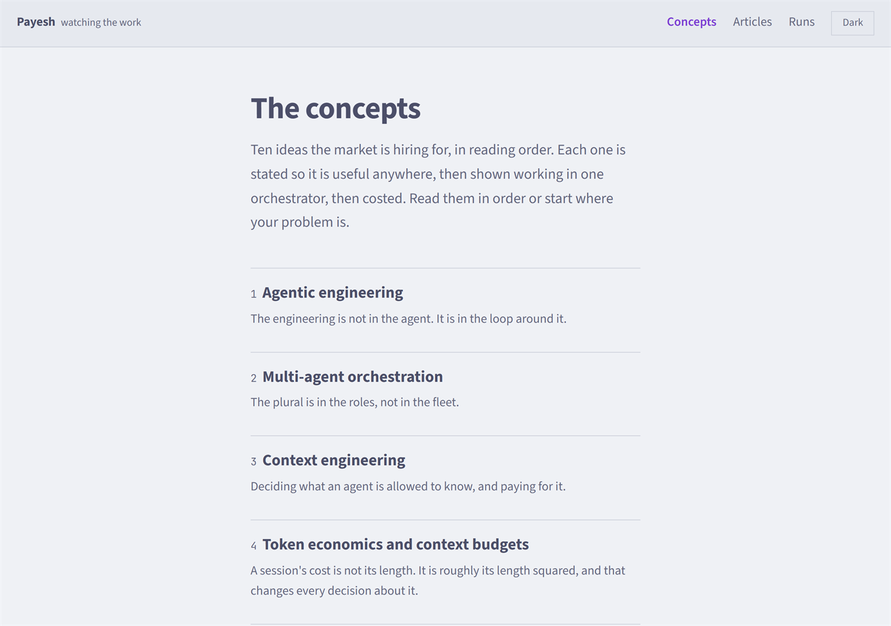
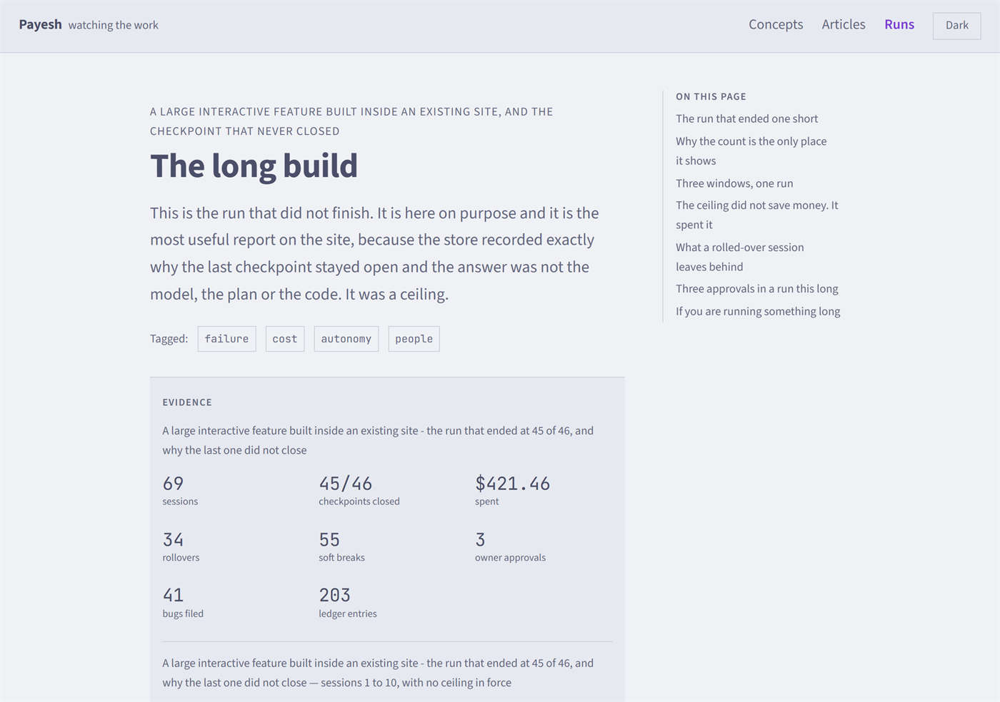
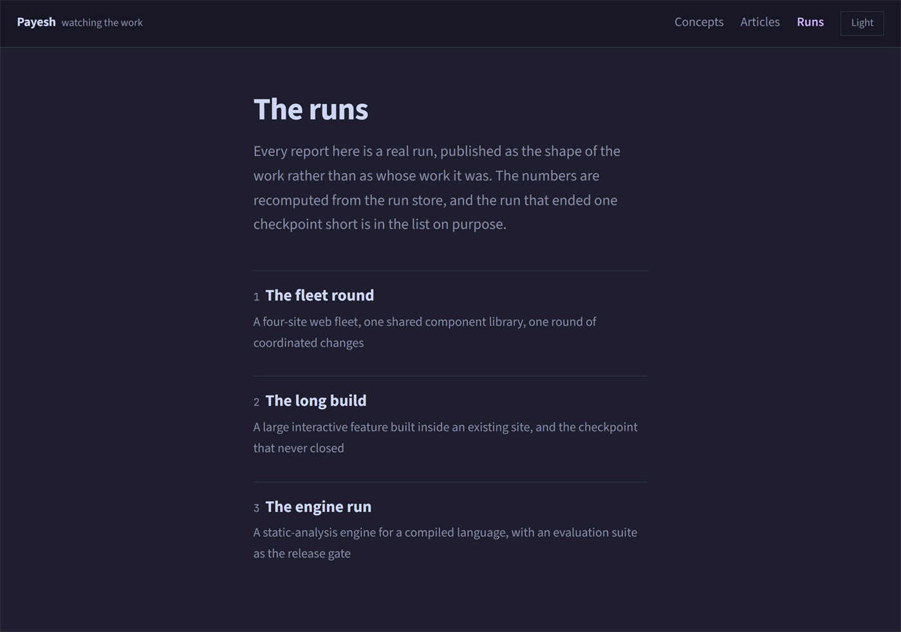
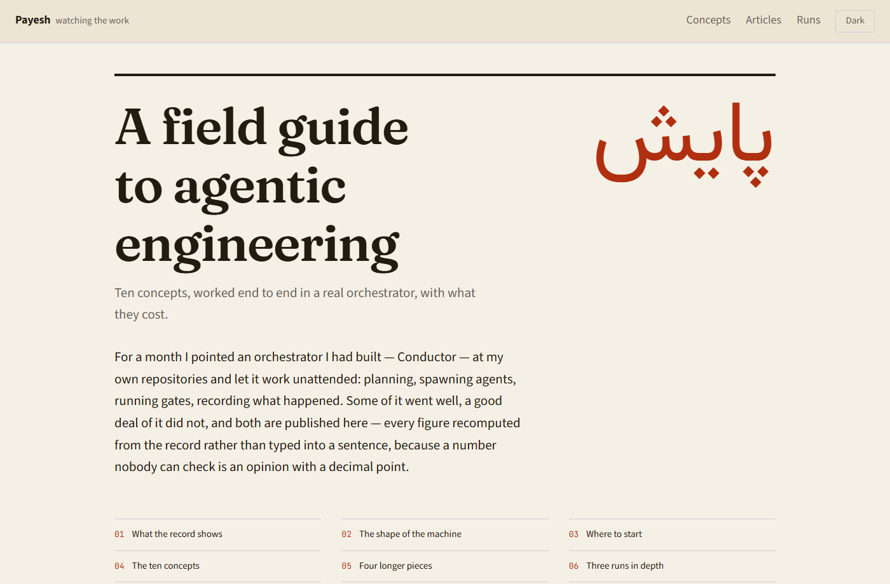
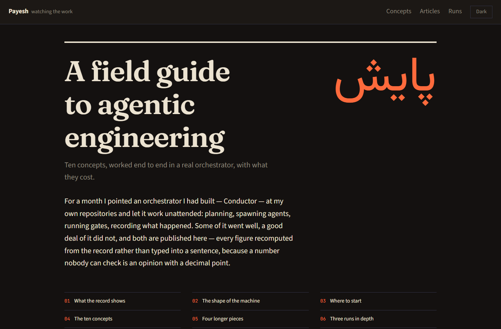

# Payesh

[](https://github.com/shaahink/payesh/actions/workflows/ci.yml)
[](https://github.com/shaahink/payesh/actions/workflows/gates.yml)
[](https://payesh.vercel.app)

The source for **<https://payesh.vercel.app>** (*Payesh*, Persian for *monitoring*) — an Astro site,
statically built, deployed on Vercel. Content is YAML validated by Zod; every figure on every page
is read from a corpus recomputed from a run store, never typed into the prose.

| `/concepts` — ten entries, in reading order | a concept — the idea, what breaks without it, how Conductor does it, then the evidence |
| --- | --- |
|  |  |

| a report — the evidence strip, every number read from the corpus | `/runs` — the anonymised corpus, published as shapes of work |
| --- | --- |
|  |  |

## The content

| Section | What |
| --- | --- |
| `/` | The findings — each with the figure behind it and a route to where it is argued |
| `/concepts` | Ten concepts — agentic engineering, multi-agent orchestration, context engineering, token economics, evals and gates, independent verification, durable execution, human-in-the-loop, agent observability, agent memory |
| `/articles` | Four longer pieces, each carrying at least one number nobody else publishes |
| `/runs` | Three anonymised reports from real autonomous runs — each run's dates, how long the machine actually worked, and how long it took on a calendar |
| `/tags` | Eight cross-cutting subjects, each gathering the concepts, articles and reports that share it |
| `/glossary` | The terms, defined once |
| `/roadmap` | What is built and what is intended, labelled as intent |
| `/edit` | The editor route — see [`CMS.md`](CMS.md) |

### The content model

One file per entry, YAML, and the file name is the entry id — so `context-engineering.yaml` is both
the segment its URL ends in and the name another concept's `readNext` refers to.

```
src/content/
  pages/home.yaml         the front page's findings
  concepts/*.yaml         10   src/content/schema.ts   the Zod schemas
  articles/*.yaml          4   src/content.config.ts   the loaders
  reports/*.yaml           3
  sections/*.yaml          3   the three index pages' own copy
```

The schemas and the loaders are deliberately in separate files: `astro:content` and `astro/loaders`
only exist inside Astro's build, so keeping the schemas on Zod alone lets the editor's Vercel
function validate against the very same definitions the build does. Adding a collection touches
three places — the schema, the loader, and the `editable` map — and `test/collections.test.mjs`
holds the lists against each other so the third cannot be missed silently.

### The prose links itself

Every concept contributes its title, the market's other names for it, and the phrases this site's
own paragraphs use (`linkAs`) to a term index. The first mention of any of them on any other page
becomes a link — so adding a name to a concept wires that phrase site-wide, including into pages
written before the concept existed. `src/lib/links.ts` holds the five rules that keep it from
becoming a sea of blue.

## The look

| paper — the light scheme | soot — the dark scheme |
| --- | --- |
|  |  |

The inner pages wear Conductor's terminal Face: the sixteen colour roles in `src/styles/tokens.css`
are the exact values the Face ships in its mocha and latte schemes, so the site and the tool are
visibly one thing. The front page is the one exception — it dresses as print, warm paper and ink
with a single vermilion, with a display serif for the cover and پایش set in its own script. That
dress is scoped to `data-page="home"`; step into any concept and you are back in the Face's palette.

Every colour is a role and every size is a step: `test/tokens.test.mjs` fails the build on a hex or
a font-size literal outside the two token files, and `test/contrast.test.mjs` recomputes the
contrast of the shipped palette against the same thresholds the Face's own theme test enforces.

## The rule that shapes everything

**No figure is ever typed into content.** A page names an evidence *key*; the value is read from
`src/data/corpus.json`, which `scripts/harvest.mjs` recomputes from Conductor's run store. A page
citing a key that is not in the corpus fails the build, and the `evidence` gate goes red when the
corpus is stale.

The reports are generalised into scenarios — "a four-site web fleet with a shared component
library" rather than a client's name. Runs absent from `anonymise.json` are excluded, never
published under their real name: the rule fails closed.

## Development

```bash
npm install
npm run dev          # local dev server
npm run check        # astro check + the unit suite — must be 0 errors, 0 failures
npm run build        # must be green; the gates below read what it writes
```

Three files are generated and CI diffs all three, so none of them is ever hand-edited:

```bash
npm run headers      # vercel.json ← headers.config.mjs
npm run content      # normalise src/content
npm run editor       # copy the kit's editor stylesheets into public/
```

## The gates

Each answers one question about the built site that nothing else would catch, and each is designed
to be seen red. They run against `dist/`, so they go after `npm run build`.

| Gate | What it answers | Where it runs |
| --- | --- | --- |
| `npm run evidence` | Does the committed corpus still match the run store, and does every cited key resolve? | Locally — needs the store |
| `npm run evidence:cited` | Does every cited key resolve against the committed corpus? | CI too — needs no store |
| `npm run anonymity` | Do the built bytes carry any machine path, private name, distinctive token or quoted run name? | Locally — the list is derived from the store, never written down |
| `npm run anonymity:shapes` | Do they carry a path out of a terminal, an API token, a chat id? | CI too — a shape is a pattern, not a name |
| `npm run seo` | One canonical per page, a sitemap that is the site, robots agreeing with it, social cards that still render their own numbers | CI |
| `npm run a11y` | A lang, one identified `<main>`, a working skip link, landmarks, accessible names, tab order | CI |
| `npm run harvest` | *(not a gate)* recompute `corpus.json` from the run store | Locally |

Contrast, focus visibility and layout shift need a browser and are measured by hand — the run and
its numbers are in [`docs/evidence`](docs/evidence).

## CI

Two workflows, on purpose:

- **`ci.yml`** calls the fleet's reusable pipeline in `shaahink/.github`. It runs what every site
  in the fleet has: the types, the build, and the three generated files still matching their
  sources. Six sites were carrying byte-similar copies of that before it moved.
- **`gates.yml`** runs the four above, which the shared pipeline cannot know about. Two run whole;
  two run the half that needs no run store, and say on every run which half they did not do.

Fonts are fetched from Google at build time. That fetch is the one non-hermetic step in the build
and it has failed on Vercel while passing in CI on the same commit — see
[`docs/dev/fonts.md`](docs/dev/fonts.md).

## Provenance

The repo was `conductor-site` until 2026-08-07; GitHub redirects the old path and the old
`conductor-site-virid.vercel.app` alias is still attached to the Vercel project, so nothing
published before the rename has broken.

The site was built by [Conductor](https://github.com/shaahink/conductor) driving this repository
unattended, one stage at a time — which is why [`conductor.plan.json`](conductor.plan.json) and
[`TRACKER.md`](TRACKER.md) are in the tree. [`docs/SPEC.md`](docs/SPEC.md) is the design that run
was given.

## Licence

Content © Shahin Kiassat. Code MIT — see [LICENSE](LICENSE).
